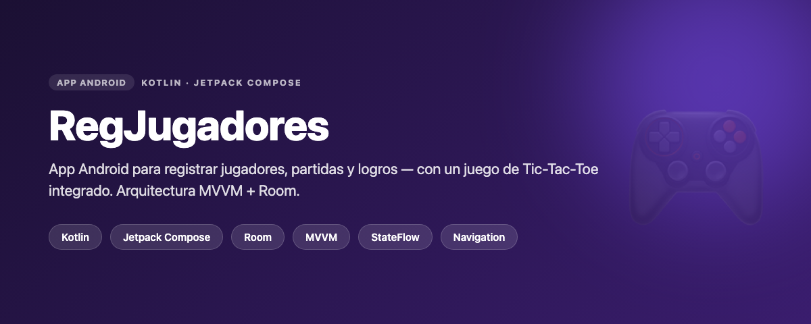

# RegJugadores 🎮

> App **Android nativa** para registrar jugadores, partidas y logros, con un juego de **Tic-Tac-Toe** integrado. Construida con Jetpack Compose, Room y arquitectura MVVM.




---

## 📌 Qué es

App Android que gestiona **jugadores**, **partidas** y **logros** con persistencia local, e incluye un **Tic-Tac-Toe** jugable que registra los resultados. Es un proyecto para practicar el stack moderno de Android (Compose + Room + MVVM) con una arquitectura limpia por capas.

## ✨ Funcionalidades

- **Registro y edición de jugadores** (con validación de nombres duplicados).
- **Registro de partidas** con jugadores asociados (relación muchos-a-muchos).
- **Sistema de logros** registrables y consultables.
- **Tic-Tac-Toe** jugable integrado.
- **Persistencia local** con Room (sobrevive al cierre de la app).
- **Navegación** entre pantallas con barra inferior personalizada.

## 🏗️ Arquitectura

Sigue el patrón **MVVM** recomendado por Google, con separación por capas:

```
ui/            → Pantallas (Compose) + ViewModels + Factories
  theme/       → Color, tipografía y tema Material 3
navigation/    → NavHost, rutas y barra de navegación
data/
  local/       → Entidades Room, DAOs y base de datos
  repository/  → Repositorios (capa entre ViewModel y DAO)
```

**Flujo de datos reactivo:** `Room (Flow)` → `Repository` → `ViewModel (StateFlow)` → `UI (Compose)`. La UI se recompone automáticamente al cambiar los datos.

## 🛠️ Stack tecnológico

| Área | Tecnología |
|------|-----------|
| Lenguaje | Kotlin |
| UI | Jetpack Compose, Material 3 |
| Arquitectura | MVVM + Repository pattern |
| Estado | StateFlow + Coroutines (`viewModelScope`, `stateIn`) |
| Persistencia | Room (entidades, DAOs, relaciones) |
| Navegación | Navigation Compose |
| Ciclo de vida | Lifecycle / ViewModel |

## 🚀 Cómo ejecutar

```bash
# Requisitos: Android Studio (Hedgehog+) y un emulador o dispositivo (Android 8.0 / API 26+)
1. Clona el repositorio.
2. Ábrelo en Android Studio y deja que sincronice Gradle.
3. Pulsa ▶️ Run sobre un emulador o dispositivo.
```

## 📸 Capturas

> _Capturas de la app en ejecución — pendientes de agregar (registro de jugadores, partida, Tic-Tac-Toe, logros)._

---

### 👤 Autor

**Angelix Vásquez** · Angelixvrobles1234@outlook.com · [LinkedIn](https://linkedin.com/in/TU-USUARIO)

<!-- 👆 Actualiza el enlace de LinkedIn y agrega capturas en /docs -->
